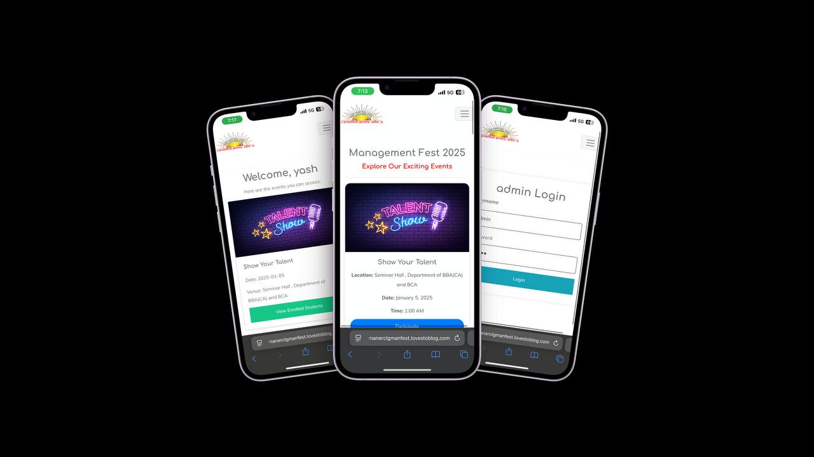
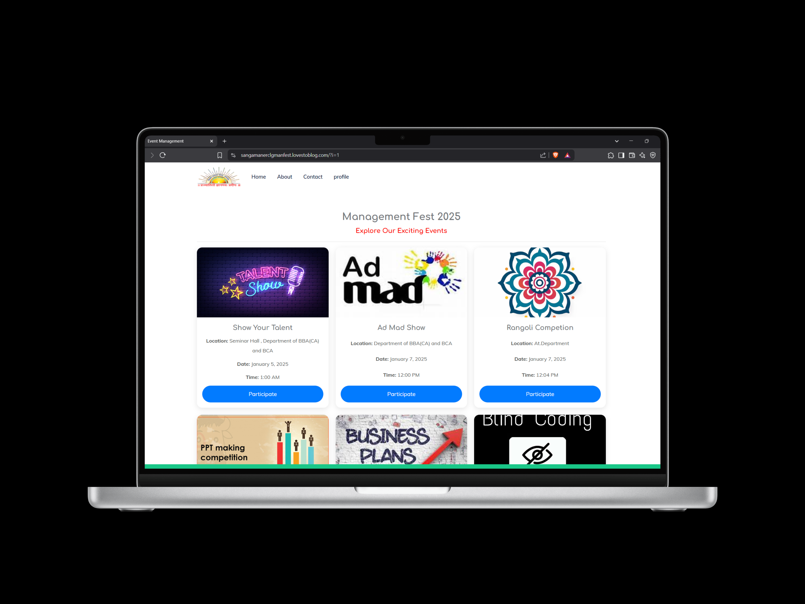

# **Management Fest 2K25**

## 🏆 Overview
Management Fest 2K25 is a web-based platform designed to streamline event management for college fests. It provides a user-friendly interface for students, coordinators, and administrators to manage registrations, schedules, and certificates efficiently.

---

## 📸 Screenshots
Here are some screenshots of the application:





---

## 🌐 Live Site
The website is deployed on **InfinityFree** and accessible at:  
🔗 [https://sangamanerclgmanfest.lovestoblog.com](https://sangamanerclgmanfest.lovestoblog.com)

---
## 🚀 Features
- 🔑 **User Registration & Authentication** – Secure login for students, coordinators, and admins.
- 📅 **Event Management** – Admins can create, edit, and delete events.
- 📝 **Student Registration** – Easy registration for multiple events.
- 🎭 **Coordinator Dashboard** – Manage student participation and oversee event details.
- 🎛️ **Admin Panel** – Manage events, users, and certificates.
- 🎓 **Certificate Generation** – Generate and validate certificates using `fpdf`.

---

## 🛠️ Technologies Used
- **Frontend**: 🟡 PHP, HTML, CSS, JavaScript
- **Backend**: 🐘 PHP (Core PHP)
- **Database**: 🛢️ MySQL
- **Styling**: 🎨 Bootstrap
- **Authentication**: 🔐 PHP Session-based authentication
- **PDF Generation**: 🖨️ FPDF

---

## 📥 Installation
1. **Clone the repository:**
   ```sh
   git clone https://github.com/yashkatore31/college_fest.git
   ```
2. **Move to the project directory:**
   ```sh
   cd college_fest
   ```
3. **Set up the database:**
   - Import `DATABASE FILE/management_fest.sql` into MySQL.
   - Configure database settings in `./config.php` and `./admin/db_connection.php`.

4. **Start Apache and MySQL using XAMPP.**
5. **Access the application:**
   ```
   http://localhost/college_fest/
   ```

---

## 📂 Folder Structure
```
college_fest/
│   index.php              # Home Page
│   config.php             # Main Database Configuration
│   login.php              # User Login Page
│   register.php           # User Registration Page
│   certificate.php        # Certificate Page
│   generate_certificate.php # Generate PDF Certificates
│   readme.md              # Project Documentation
│
├───admin
│   │   index.php           # Admin Dashboard
│   │   login.php           # Admin Login
│   │   manage_events.php   # Manage Events
│   │   manage_students.php # Manage Student Data
│   │   manage_certificates.php # Approve & Generate Certificates
│   │   db_connection.php   # Admin Database Connection
│   └───... (other admin functionalities)
│
├───cord                   # Coordinator Panel
│   │   index.php
│   │   login.php
│   │   view_students.php
│   └───...
│
├───css                    # Stylesheets
│   │   bootstrap.min.css
│   │   style.css
│   └───...
│
├───fpdf                   # Certificate PDF Generation
│   │   fpdf.php
│   └───font/...
│
├───include                # Common Includes
│   │   header.php
│   │   footer.php
│   └───...
│
├───js                     # JavaScript Files
│   │   jquery.min.js
│   │   bootstrap.min.js
│   └───...
│
└───images                 # Image Assets
    │   facebook.png
    │   instagram.png
    └───...
```

---

## 🔑 User Roles
- **Admin** – Full access to manage events, users, and certificates.
- **Coordinator** – Manages specific event-related tasks.
- **Student** – Registers and participates in events.

---

## 🤝 Contributing
1. **Fork the repository** 📌
2. **Create a feature branch** (`git checkout -b feature-name`) 🚀
3. **Commit your changes** (`git commit -m 'Added feature XYZ'`) 📝
4. **Push to the branch** (`git push origin feature-name`) 🔄
5. **Create a Pull Request** ✅

---

## 📧 Contact
For queries or contributions, reach out at ✉️ [dev.yashkatore@gmail.com](mailto:dev.yashkatore@gmail.com).

